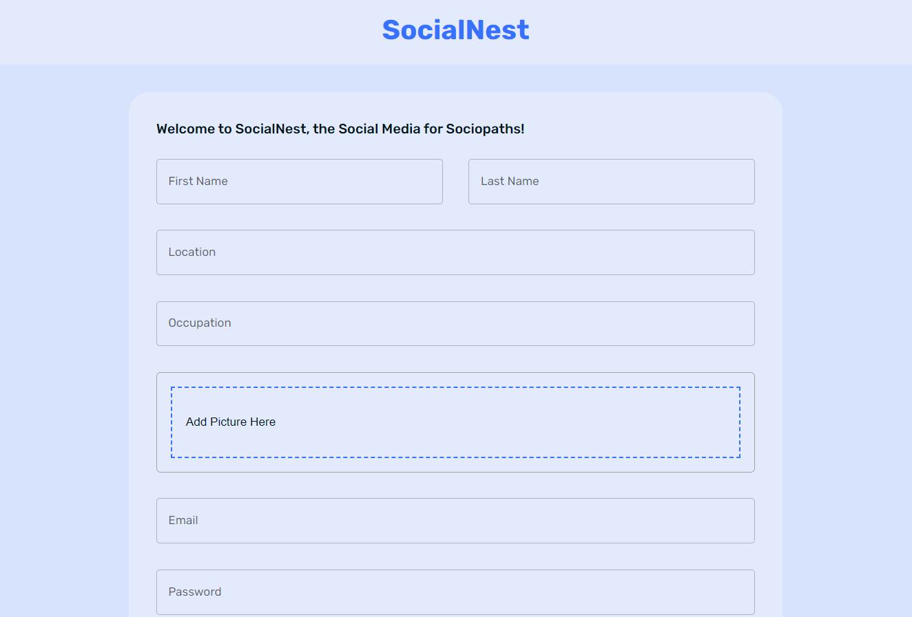

Social Networking Site 

<h3 align="left">Login Page : </h3>

<h3 align="left">Posts UI : </h3>

<h3 align="left">SignUP Page : </h3>

<h3 align="left">UI in Dark Mode Page : </h3>

<h3 align="left">UI in Light Mode: </h3>

